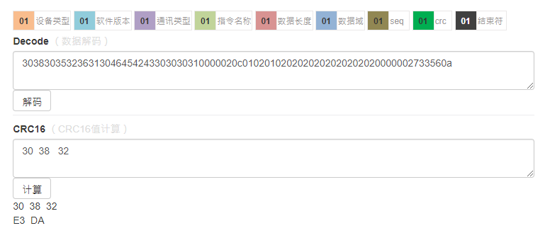

## example

### Usage

**1、 安装扩展**

  ```composer require dodosss/crc dev-master```

**2、 添加```helps.php``` 自动加载**

```
{
	"autoload": {
		"files": ["vendor/dodosss/crc/src/CRC/helps.php"]
	},
	"require": {
		"dodosss/crc": "dev-master"
	}
}
```
**3、 PHP调用**

```
<?php
use Dodosss\Crc\CRC16;
require_once './vendor/autoload.php';
$crc = new CRC16();
$crcResult = $crc->calc("303832");
echo $crcResult."<br/>"; // DAE3
```
结果如下：

